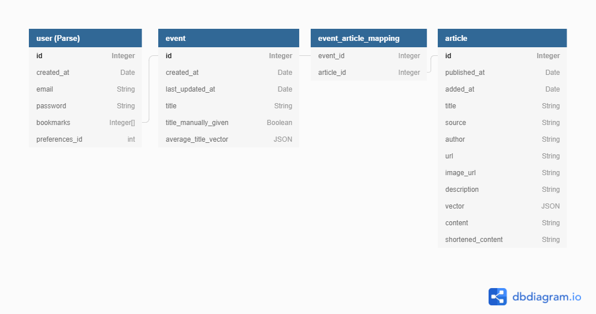

# Dipole News

[Link to backend server repo](https://github.com/kylediaz/dipole-news-server)

## Table of Contents
1. [Overview](#Overview)
1. [Product Spec](#Product-Spec)
1. [Wireframes](#Wireframes)
2. [Schema](#Schema)

## Overview
### Description
4/5ths of Americans consume media from both sides of the political spectrum. Suppose an event 
happens and a person wants to get information from both CNN and Fox news. They would have to search 
up the news story on each news outlet’s respective website and find an appropriate article for each.
 The most popular news aggregators (Feedly, Google News, Morning News, etc) do not have a function 
 in order to streamline this process. Dipole News App fills this niche.

### App Evaluation
- **Category:** News and Magazines
- **Mobile:** Can be both a mobile app and website
- **Story:**
- **Market:** General news consumers like the ones stated in the description. If nice-to-have 
              stories blacklist and RSS feeds are achieved, the market can extend to general consumers.
- **Habit:** Reading the daily news
- **Scope:**

## Product Spec

### 1. User Stories (Required and Optional)

**Required Must-have Stories**

* User can scroll through a timeline of articles grouped together by event
    * Swipe to hide, double tap to bookmark
* Select an event to see all the articles on that event
* Sign up/Log in/out of the app
* Bookmark/follow events

**Optional Nice-to-have Stories**

* Optionally filter out some of the default news sources
* Lazy-load content so the app is more responsive

### 2. Screen Archetypes

* News Feed
    * Gestures: Double tap to bookmark
* Bookmarks
* Article list
    * Gestures: Swipe horizonally to switch article, swipe down to dismiss article reader
* User
    * Sign up or Log in/out
    * Settings

### 3. Navigation

**Tab Navigation** (Tab to Screen)

* News Feed
* Bookmarks
* User

**Flow Navigation** (Screen to Screen)

* News Feed -> Articles in an event -> Detailed article view
* User -> Log in/Sign up

## Wireframes

## Schema 

### Models

Preferences Schema depends on stories implemented

### Networking
#### Home Feed, Bookmarks
* (Read/GET) Get feed of events
* (Read/GET) Get articles in a feed of events (Preloaded in this activity)
* (Update/PUT) Bookmark an event
* (Delete) Delete a bookmark

##### Article List
* (Read/GET) Get full article

#### User
* (Create/POST) Sign up
* (Update/PUT) Log in
* (Update/PUT) Log out