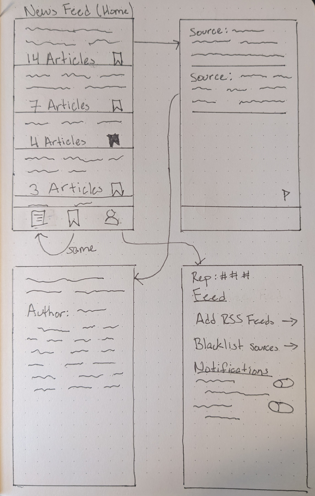
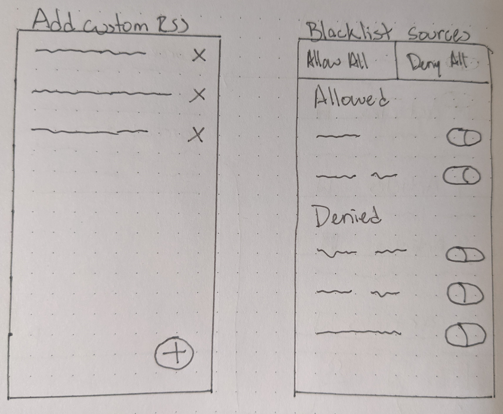

# Dipole News

## Table of Contents
1. [Overview](#Overview)
1. [Product Spec](#Product-Spec)
1. [Wireframes](#Wireframes)
2. [Schema](#Schema)

## Overview
### Description
4/5ths of Americans consume media from both sides of the political spectrum. Suppose an event 
happens and a person wants to get information from both CNN and Fox news. They would have to search 
up the news story on each news outlet’s respective website and find an appropriate article for each.
 The most popular news aggregators (Feedly, Google News, Morning News, etc) do not have a function 
 in order to streamline this process. Dipole News App fills this niche.

### App Evaluation
- **Category:** News and Magazines
- **Mobile:** Can be both a mobile app and website
- **Story:**
- **Market:** General news consumers like the ones stated in the description. If nice-to-have 
              stories blacklist and RSS feeds are achieved, the market can extend to general consumers.
- **Habit:** Reading the daily news
- **Scope:**

## Product Spec

### 1. User Stories (Required and Optional)

**Required Must-have Stories**

* User can scroll through a timeline of articles grouped together by event
    * Swipe to hide, double tap to bookmark
* Select an event to see all the articles on that event
* Sign up/Log in/out of the app
* Bookmark/follow events

**Optional Nice-to-have Stories**

* Get notified when a new article is added to a bookmarked event
* Users can report incorrect groupings made by the algorithm
    * point/rep system for those who have a good history of reports
* Optionally filter out some of the default news sources
* User can add their own RSS feed
* Lazy-load content so the app is more responsive

### 2. Screen Archetypes

* News Feed
    * Gestures: Swipe to hide from view, double tap to add to bookmarks, etc.
* Bookmarks
* User
    * Display optional rep points
        * Optionally show "You have more points than X% of other users!"
    * Settings
        * Turn notifications on/off
        * Blacklist/Whitelist notifications from certain sources
    * Optional custom RSS feeds

### 3. Navigation

**Tab Navigation** (Tab to Screen)

* News Feed
* Bookmarks
* User

**Flow Navigation** (Screen to Screen)

* News Feed -> Articles in an event -> Detailed article view
* User -> Log in/Sign up
* User (Settings section) -> Blacklist/whitelist sources
* User (Notification section) -> Blacklist/whitelist sources for notifications
* User (Settings section) -> Add/Remove custom RSS feeds

## Wireframes

## Schema 

### Models

Article
| Property         | Type          | Description                       |
|------------------|---------------|-----------------------------------|
| \_id             | int           | unique id                         |
| Title            | String        | Title of Article                  |
| Author           | String        | Name of author                    |
| Creation         | DateTime      | DateTime when article was created |
| Content          | String        | Body of article                   |
| ShortenedContent | String        | Shortened body of article         |
| TitleVector      | Integer Array | Cache of vectorized title         |

Event
| Property           | Type                 | Description                                                      |
|--------------------|----------------------|------------------------------------------------------------------|
| \_id               | int                  | unique id                                                        |
| Title              | String               | Title for the event                                              |
| TitleManuallyGiven | Boolean              | Whether the automatically given title was manually overwritten   |
| LastUpdated        | Date                 | DateTime of the last time a news article was added to this event |
| Articles           | Article Schema Array | Articles in this event                                           |
| AverageVector      | Integer Array        | Center value of all vectors of the articles in this event        |

User
| Property    | Type                | Description                       |
|-------------|---------------------|-----------------------------------|
| \_id        | int                 | unique id                         |
| Email       | String              | Email of user                     |
| Password    | String              | Hashed password                   |
| Bookmarks   | Event ID Array      | IDs/Pointers of bookmarked events |
| Preferences | Preference Schema   | User settings preferences         |

Preferences Schema depends on stories implemented

### Networking
#### Home Feed, Bookmarks
* (Read/GET) Get feed of events
* (Read/GET) Get articles in a feed of events
* (Update/PUT) Bookmark an event
* (Delete) Delete a bookmark
* (Create/POST) Reporting an article

#### User
* (Update/PUT) Update a preference
* (Create/PUT) Sign up

#### Add RSS Feeds
* (Create/POST) Add an RSS feed
* (Delete) Delete an RSS feed